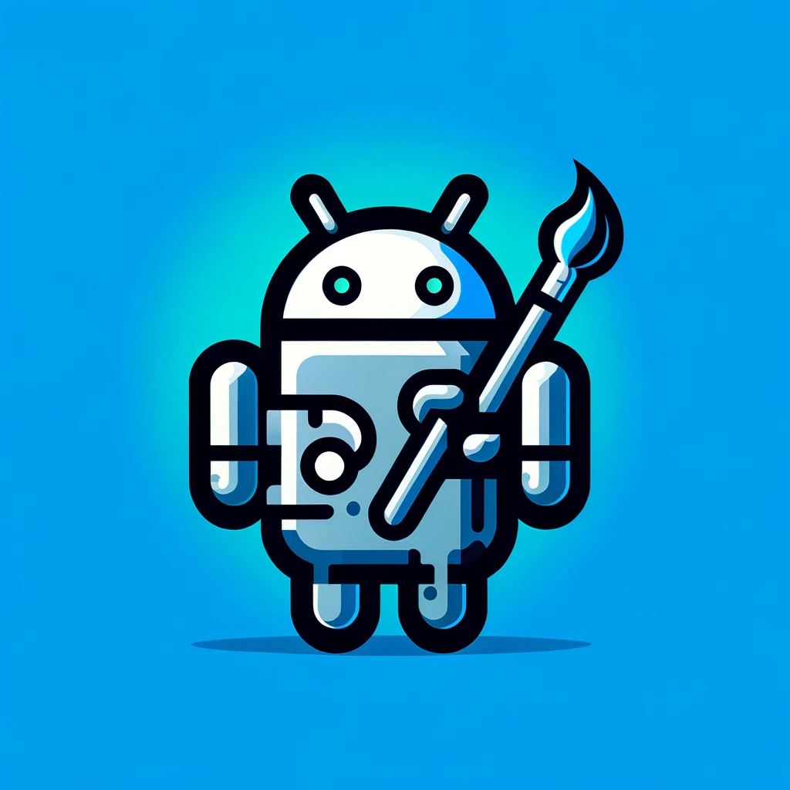

# Painting Droid

[DEMO](https://painting-droid-web.vercel.app/) | Progress: ▓▓▓▓▓░░░░░░░░░░░░░░░ 32%

  

---

  

---

Painting Droid is an AI-powered cross-platform painting app inspired by the legendary MS Paint, but expandable with plugins and open. It utilizes various AI models, from paid providers to self-hosted open-source models, as well as some lightweight ones built into the app. It works in the browser and as a desktop app on Windows, macOS, and Linux.

## Features

- Your regular painting app features (e.g., brush, annotate, fill, etc.).
- Fill selected areas with AI-generated content.
- Augment selected areas with AI-generated content (e.g., add a tree to a landscape or remove the background).
- Apply filters and effects to the entire image or a selected area.
- Resize, crop, rotate, and flip the image.
- Plugin support.
- Cross-platform compatibility.

## Overview

## How to develop

### Web app

If you don't have it, install [pnpm](https://pnpm.io/installation) (Not required for Github Codespaces).

#### Locally

1. Clone the repository
2. Install the dependencies using `pnpm install`
3. Run the app using `pnpm dev:web`

#### Using Dev Container

1. Clone the repository
2. Make sure you have Docker, Visual Studio Code and [Dev Container](https://marketplace.visualstudio.com/items?itemName=ms-vscode-remote.remote-containers) extension installed
3. Open the repository in Visual Studio Code
4. Open the command palette and run `Dev Containers: Reopen in Container`
5. Install the dependencies using `pnpm install`
6. Run the app using `pnpm dev:web`

#### Using Github Codespaces

1. 
2. Install the dependencies using `pnpm install`
3. Run the app using `pnpm dev:web`

### Desktop app

1. Clone the repository
2. Install [Tauri prerequisites](https://tauri.app/v1/guides/getting-started/prerequisites/)
3. Install the dependencies using `pnpm install`
4. Run the app using `pnpm dev:desktop`

## Platform support

| Platform | Supported                 |
| -------- | ------------------------- |
| Browser  | yes (limited AI features) |
| Windows  | yes                       |
| MacOS    | yes                       |
| Linux    | yes (not tested)          |

## Roadmap

### Core features

- [x] Basic UI layout
- [x] Canvas manipulation
- [x] Canvas layers
- [x] Drawing tools: brush, pencil
- [x] Undo/Redo functionality
- [x] Command palette
- [x] State preservation
- [x] Custom 'Project' file format
- [x] Saving and loading projects
- [x] Area selection
- [x] Responsive UI
- [x] Online Demo Model for Web
- [x] WASM adjustments mechanism
- [x] Some Offline JS Model
- [ ] Image resize/crop
- [ ] Clipboard support
- [ ] Desktop app releases and autoupdate

### AI features (Desktop only)

- [ ] Stable Diffusion Docker image for local server
- [ ] Integration with DALL-E
- [ ] Integration with Stability.ai
- [ ] Integration with Midjourney

### Post MVP

- [ ] Use Blob instead of base64 for storing images
- [ ] Use IndexDB instead of localStorage for image data
- [ ] More image adjustments
- [ ] More tools: fill, erase, magic wand, text
- [ ] Release notes popup
- [ ] Change renderer to webgl/webgpu
- [ ] Optimize image conversions with Rust
- [ ] Custom app menu for MacOS
- [ ] Annotation tools: line, rectangle, circle
- [ ] Plugin support

### License

[MIT](https://choosealicense.com/licenses/mit/)
